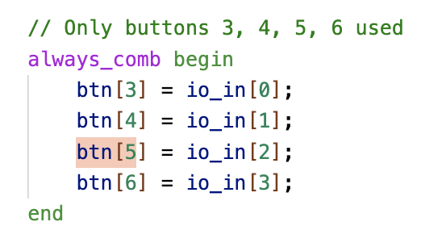
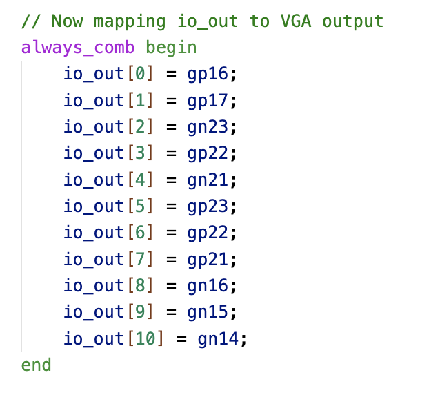
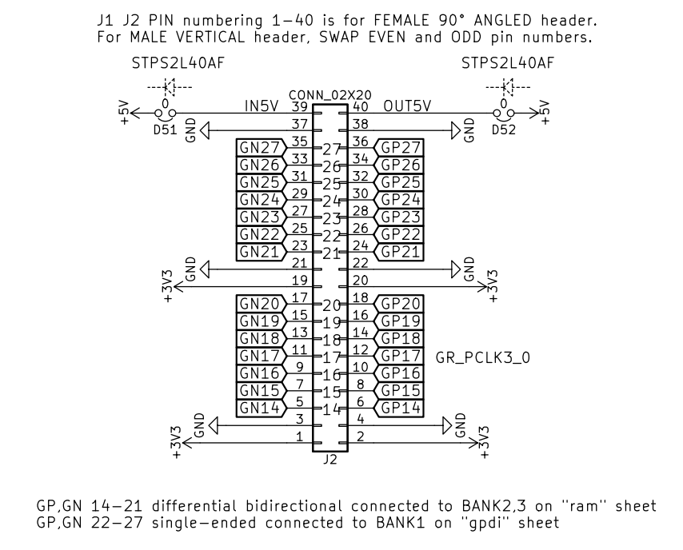

# Tiny Game of Life!

Sebastian Garcia
18-224 Spring 2024 Final Tapeout Project

## Overview

My chip implements Conway's Game of Life on an 8 by 8 grid with two tile colors,
green and blue. The neighbors of each tile are the 4 adjacent tiles (not the
diagonally adjacent ones). The user can choose an arbitrary start state and then
watch the Game play out.

## How it Works

The core of Game of Life is the state registers which store the color of each tile
in the grid. These tiles are generated using generate statements so by changing
the high level parameters (number of rows/cols and tile width/height) you can 
easily change the dimensions of the Game. Additionally, each state register knows
where it is in the grid so to determine what its next state should be, it simply
counts the numbers of neighbors surrounding it and uses that number to choose the
next state. 

To actually render the game, each tile also has a corresponding, combination 
is_pixel_in_tile module that outputs True if the current pixel being selected by
the VGA driver is in that tile. Then that signal is used to index into a specific
state register to determine the color of the pixel. This is done using 2D unpacked
arrays.

Lastly, to add some complexity to the Game, on startup that user can set an 
arbitrary start state with some buttons. One button is used to shift through
all the tiles and another button is used to color the selected tile. These buttons
should be active-high and must be held down for about 1 second to be registered
if the clock is running at 25 MHz. Once the user is done setting the start state.
she/he can press another button to begin running the simulation and relishing 
in its endless complexity. To reset back to the start state, the user must simply
press the reset button.

## Inputs/Outputs

The buttons should be mapped to io_in inputs according to these assignments:

btn[3] is used to change the position of the selected tile when the system is in
setup mode (the first stage in the video demo). btn[4] is used to save the state
of the selected tile in setup mode. And btn[6] is used to go to the simulation
state where the Game of Life will play out.

Similarly, the VGA outputs (if using a PMOD VGA connector like the one from
Digilent) should be the following:

Only 11 of the 12 outputs are used. Each output is used for the VGA display. The
pin names correspond to the pins shown in the diagram below for the PMOD VGA
connector.

## Hardware Peripherals

4 buttons should be used with this system. 3 for setting up the initial state
of the Game of Life and one for reset. A VGA monitor, cable, and connector
should also be used.

## Design Testing / Bringup

To test the design, simply hook up buttons and a VGA monitor to the chip (using
a custom PCB). Then, press the buttons specified above to set the initial state 
of the Game, press the start button to set the game in motion, and watch as 
the cellular automata plays out.    

There is also a testbench.py CocoTB test function in the src folder which 
runs through pixel values and checks what the state of each should be.

## Media

There is a demo video in Demo_Video.mov

